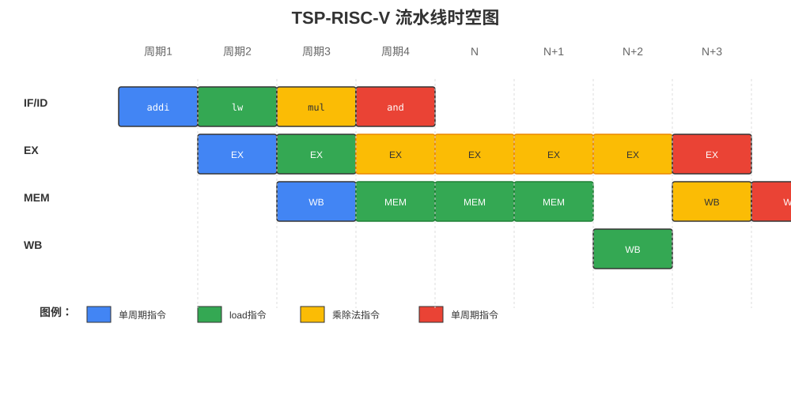
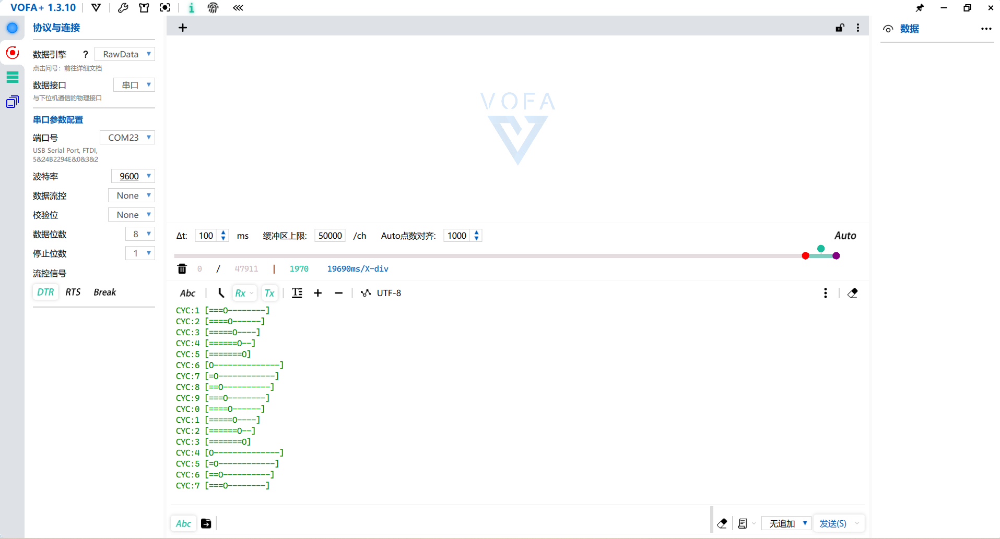
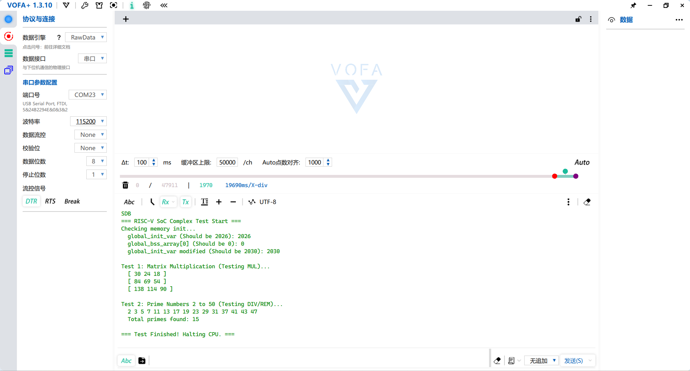

# TSP_RISC-V

## 概述

这是一个用verilog编写的RISC-V内核，支持RV32IM指令集。顺序发射、乱序执行架构。已在FPGA上通过risc-v交叉编译器进行验证

开发ing/允许二次开发


## 特征

1. 32 位 RISC-V ISA CPU 内核
2. 支持RV32IM指令子集
3. 全部可综合的verilog 2001
4. 支持axi4-lite总线
5. 支持uart下载程序（待开发）
6. 紧耦合ITCM/STCM模型
7. 顺序单发射、乱序执行架构
8. 4级流水线架构(IF/ID,EXU,LSU,WB)


## 目录

```
TSP_RVmaster/
├── RTL/                          # 内核源码
│   ├── core/                     # CPU核心模块
│   │   ├── core.v                # 顶层模块
│   │   ├── defines.v             # 全局定义
│   │   ├── idec.v                # 指令译码
│   │   ├── Ifu.v                 # 指令取指
│   │   ├── exu_*.v               # 执行单元
│   │   ├── PC_control.v          # PC控制
│   │   ├── regfiles.v            # 寄存器堆
│   │   └── wb_arbiter.v          # 写回仲裁
│   ├── peripheral/               # 外设模块
│   │   └── uart/                 # UART模块
│   └── sim/                      # 仿真测试
├── FPGA/                         # FPGA工程
│   ├── pango_cpu/               # Pango FPGA项目
│   └── zynq7200_cpu/            # Zynq FPGA项目
├── doc/                          # 文档
│   ├── 参考资料/                 # RISC-V规范文档
│   └── 系统示意图/               # 系统架构图
├── template/                     # 开发模板
│   ├── tools/                   # 开发工具
│   └── TSP_RISCV_template/      # RISC-V模板
└── readme.md                     # 项目说明文档
```

**目录说明：**

- **RTL/core/**: CPU核心代码，包含取指、译码、执行、访存、写回等流水线模块
- **RTL/peripheral/**: 外设模块
- **RTL/sim/**: 仿真测试文件，用于功能验证
- **FPGA/**: 针对不同FPGA平台的工程文件
- **doc/**: 项目文档，包括RISC-V规范和系统架构图
- **template/**: 开发模板和工具链配置

## 系统
### 流水线结构



**流水线说明：**
- **IF (取指)**: 从ITCM取指令，支持BTB分支预测
- **ID (译码)**: 全组合逻辑译码，可二次开发为单级流水线以提升fmax
- **EX (执行)**: ALU运算、分支计算。开发最小化计分板及forwarding以支持乱序执行
- **MEM (访存)**: Load/Store访存操作。SCTM挂载于axi-lite总线
- **WB (写回)**: ALU计算结果、访存结果写回寄存器堆

**外设：**
- **uart(0x4000_0000)**: 异步串口外设。可通过串口下载程序（待开发）
- **spi/iic/hdmi**：待开发


## 仿真
提供modelsim仿真模板：
- **/RTL/sim/boot.txt**：指令存储文件。通过$readmemh读入指令到ITCM
- **/RTL/sim/modelsim_filelist.f**：modelsim仿真文件指定
- **/RTL/sim/modelsim_sim.do**：modelsim仿真TCL脚本，用于自动化编译和仿真流程。修改set tbname ***指定编译testbench
- **/RTL/sim/sim.bat**：modelsim仿真快速启动脚本
- **/RTL/sim/tb_soc_top.v**：顶层soc testbench

## IDE图形化开发
基于MRS(MounRiver Studio)V1.92作为开发工具。下载链接：https://www.mounriver.com/download
- **template/TSP_RISCV_template/src**：提供lds链接文件及TSP_RISCV_template.wvproj示例工程
- **template/TSP_RISCV_template/lib**：提供startup.S示例
- **template/tools**：提供编译后bin文件转为txt文件的python工具

在紫光pango pgl50g芯片上进行串口发送测试成功，如图（串口测试软件VOFA）：



## 帮助
本项目借鉴蜂鸟e203(https://github.com/riscv-mcu/e203_hbirdv2)开发思路、SparrowRV(https://github.com/xiaowuzxc/SparrowRV)开发思路
感谢以下项目：
https://github.com/IanC910/Simple_AXI_RAM
https://github.com/hrvatch/axi4_lite_uart